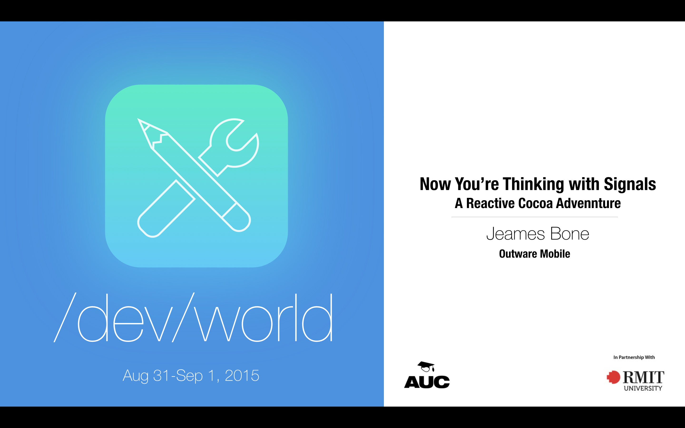
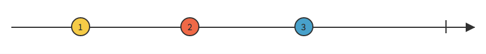
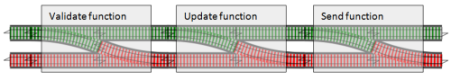

---

## Now You're Thinking With Signals!
### _A ReactiveCocoa Adventure_

---

## Who is this guy?

_Jeames Bone_

iOS Software Engineer _@_ Outware Mobile

_@jeamesbone_ on all the things.

^ No that's not a typo.
^ Working at Outware Mobile creating awesome iOS apps.
^ @jeamesbone on twitter (and everything else).

---

# [fit] Functional
# [fit] Reactive
# [fit] Programming

^
- So for the last 6 months I've been using a type of programming called Functional Reactive Programming, and I think it's pretty amazing.
- Warning you now, most of this talk is going to be pretty high level, with some examples at the end to give you a taste of how it works
- What it is
- Why use it
- How to use it (Using ReactiveCocoa 3 In swift 2!)

---

# What is FRP?

---


# F for Functional

  - Immutable
  - Stateless

^
- Let's start with F for functional.
- So when I first started looking into FRP, I hadn't been exposed to functional programming before. I made the mistake of reading some info on it  and promptly ran away when I read "lambda calculus", "endofunctors" and "monoids" in the first paragraph.
- Now all that stuff is actually pretty interesting once you get into it, but you don't need to know any of that to use functional ideas in FRP.
- Functional Programming: Uses functions as the fundamental building blocks of your program.
- Functional programs are immutable, don't modifying existing data.
- They are stateless: This just means that if you call a function with the same input, you should always get the same output.
- This is great because state is bad.

---


# R for Reactive

- *What* instead of *how*
- Derived state

> Instead of telling a computer how to do its job, why don't we just tell it what it's job is and let it figure the rest out?

^
- Next is R for reactive
- This quote is from the reactive cocoa philosophy page.
- *read quote* - this is the core idea of reactive programming.
- Think of reactive programming like a spreadsheet. When you change a value, it propagates to where it is referenced via rules.
- Specify the behaviour up-front instead of logic being scattered around your code.

---

# Functional Reactive Programming

- Combines functional and reactive paradigms.
- Uses streams of values and transformations on streams to derive state.

---

# Why FRP

> UIs are big, messy, mutable, stateful bags of sadness.

- Reduce mutable state
- Simpler programs
- Better code

^
- Quote from Josh Abernathy
- *Apps* are big messy, mutable...
- Mutable state is complex and error prone.
- Problem: Apps are inherently stateful.
- We currently write apps by poking at them when something changes, and hoping that it all works out.
- Almost everything we do is asynchronous, with UI, networking, callbacks from a watch to a phone app. Reactive programming is just plain better at modeling these interactions
- Race conditions
- Time is treated as a first class citizen

---

# [fit] ReactiveCocoa

^
- ReactiveCocoa is the FRP framework we use in iOS/Mac development.
- Open source, with an active community.
- Originally inspired by the Reactive Extensions (Rx) framework in C#. But has diverged a fair bit, especially for the swift API.
- Speaking of the swift API, it's new and shiny and awesome and if you are using the Objective-C api, there will be some differences to what you see me use in swift, but the general concepts are the same.

---

# Signals

^
- Signals are the basic building block of ReactiveCocoa programs.
- Signals model streams of events over time.
- This might seem simple, but this can be used to model almost anything in your app.

---

## Events

```swift
public enum Event<T, E: ErrorType> {
	/// A value provided by the signal.
	case Next(T)

	/// The signal terminated because of an error. No further events will be
	/// received.
	case Error(E)

	/// The signal successfully terminated. No further events will be received.
	case Completed

	/// Event production on the signal has been interrupted. No further events
	/// will be received.
	case Interrupted
}
```

^ So knowing that signals send events over time, lets have a look at what an 'event' actually is!

---

## Signals



^ This is a diagram of a signal. It sends 3 numbers (1, 2 and 3) and then completes.
This simple signal sends integers, but a signal can send anything.

---

## Signals in ReactiveCocoa 3

```swift
Signal<T, E: ErrorType>
```

Signals model an existing stream of events in your app.

- User input
- Notifications
- Location Updates

^
- Signals are the basic building block of reactive cocoa
- A signal is a push driven stream of events over time
- Some examples of things that can be modeled by signals are user input like a button press or text field, notifications, location updates etc.

---

## SignalProducers

```swift
SignalProducer<T, E: ErrorType>
```

SignalProducers model the results of some work.

- Network requests
- A modal view
- A watch connectivity request

^
- SignalProducers encapsulate what we call 'cold' signals (Regular signals are called hot signals)
- Some work is done to create a new signal, and the results of that work can be subscribed to
- Examples could be a network request, presenting a modal view like an alert or actionsheet or making

---

## Errors

- Errors are passed on to the next step in the stream.
- If any point of the stream fails, we can handle this in one place.
- Railway oriented programming



^ By modeling each stage of your logic as signals, this allows the errors to propagate up the chain.
^ This means you can handle errors in one spot, and execution will automatically stop if theres an error.
^ No more callback hell!

---

# Operators

To the internet!

---

# Example

^ Lets go through a canonical example of reactive cocoa that will hopefully give you a feel for how it works.

---

```swift
let searchStrings = textField.rac_textSignal()
    .toSignalProducer()
    .map { text in text as! String }
```

^
Creates a signal that every time a text fields text is changed, we get a string sent on the signal
The UIKit extensions still have to be bridged from objectiveC, thats why we need to convert to a signal producer.

---

```swift
let searchResults = searchStrings
    .flatMap(.Latest) { query in
        let URLRequest = self.searchRequestWithEscapedQuery(query)
        return NSURLSession.sharedSession().rac_dataWithRequest(URLRequest)
    }
    .map { data, URLResponse in
        let string = String(data: data, encoding: NSUTF8StringEncoding)!
        return parseJSONResultsFromString(string)
    }
    .map { JSONResults in
        return self.parseModelFromJSON(JSONResults)
    }
    .observeOn(UIScheduler())
```

^
Don't worry too much about flat map, but just know that it works similar to map, but returns a new signal instead of a value.
- Now we have to actuallly start the signal producer so it can do the work and we can observe the results.

---

```swift
searchResults.start(next: { model in
    self.updateUIWithModel(model)
})
```

^ NB: You can also provide a closure for the other event types eg. completed or error

---


# Now for magic

^
- Lets say we had a really dodgy API
- Retry requests and handle errors

---

```swift
let searchResults = searchStrings
    .flatMap(.Latest) { query in
        let URLRequest = self.searchRequestWithEscapedQuery(query)
        return NSURLSession.sharedSession().rac_dataWithRequest(URLRequest)
            .retry(3)
            .catch { error in
                self.displayError(error)
                return SignalProducer.empty
            }
    }
    .map { data, URLResponse in
        let string = String(data: data, encoding: NSUTF8StringEncoding)!
        return parseJSONResultsFromString(string)
    }
    .map { JSONResults in
        return self.parseModelFromJSON(JSONResults)
    }
    .observeOn(UIScheduler())
```

^
- As you can see, the only code we had to add was the retry and the catch.
- This is a great example of telling the program 'what' instead of 'how'
- We don't care how the retry works internally, and we don't need to keep track of state, use recursive calls or any of that rubbish

---


# But wait there's more!

---

```swift
let searchStrings = textField.rac_textSignal()
    .toSignalProducer()
    .map { text in text as! String }
    .filter { text in text.characters.count > 4 }
    .throttle(0.5, onScheduler: QueueScheduler.mainQueueScheduler)
```

^ There are multiple operators in reactive cocoa for incorporating time into our streams, such as throttle and delay.
^ Here we are saying only take new values if at least 0.5 seconds have passed.

---

## What has this given us?
- Less code
- Maintainable code
- Readable code

---

# Where to next?

- http://reactivecocoa.io/
- Try it!

^
So the website for the framework is reactivecocoa.io, you can also just search reactivecocoa on github.
The docs are really great so don't be afraid to dive in (The source is also very well documented)
Theres so much you can do with FRP, I have only just scratched the surface in this talk.

---

# [fit] Thanks!
### Questions?
